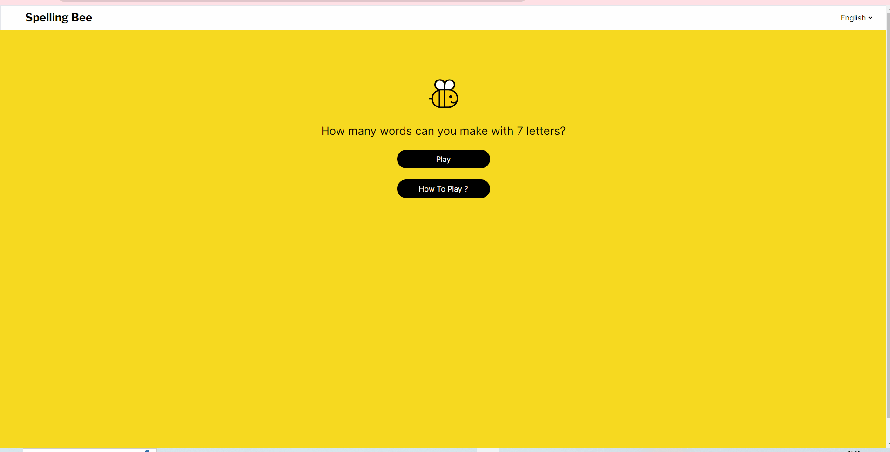

### Spelling Bee Game Project 
Spelling bee game project was created using Next js. It is a word game with Turkish and English language support.

### Project Live
[LİVE](https://spelling-bee-game-zlh.vercel.app/)

## How does my project look



### Tech/framework used

* **Next.js**: A React-based JavaScript framework used to accelerate the web application development process.
* **Tailwind CSS**: A framework for writing CSS. It was used for styling and layout purposes in the project.
* **React**: A JavaScript library used for building web interfaces. It was used alongside Next.js.
* **next-intl**: Used for internationalization (i18n).

### Usage
The aim of the game is to produce words from 7 letters within 1 minute, provided that the central letter is in every word. You can read the instructions for detailed information.

### Project İnstallation

* Clone the project
```bash
https://github.com/zlhshn/spelling_bee_game.git
```
* Then, install and run the project

```bash
npm install && npm run dev
```
Open [http://localhost:3000](http://localhost:3000) with your browser to see the result.